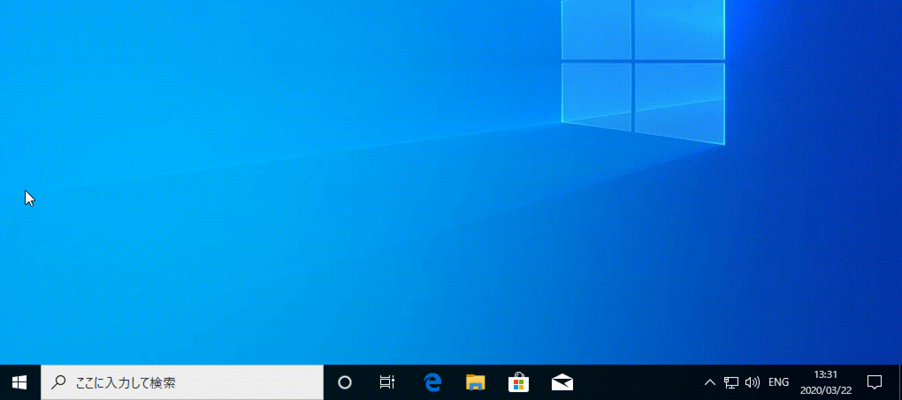

# Welcom to Hazeyama Lab !


研究室で使用するソフトウェアを一括でインストールするスクリプトファイルです．  
本リポジトリはCloneすることなく実行可能です．  

## for Windows

PowerShellを管理者権限で実行し，以下のコマンドを実行します．

<details>
<summary>PowerShellの起動方法(クリックで展開)</summary>
スタートボタンを右クリックで「Windows PowerShell(管理者)」を選択します．

</details>

```ps
Set-ExecutionPolicy RemoteSigned -scope CurrentUser
iwr -useb raw.githubusercontent.com/HazeyamaLab/setup/master/windows/install.ps1 | iex
```

## for macOS

ターミナルで以下のコマンドを実行します．

<details>
<summary>ターミナルの起動方法(クリックで展開)</summary>
<code>⌘ command</code> + <code>space</code>でSpotlightを開いて「ターミナル」で検索します．

</details>

```bash
curl -sf https://raw.githubusercontent.com/HazeyamaLab/setup/master/macOS/install.sh | sh -s
```

## インストールされるソフトウェアの一覧

以下のソフトウェアがインストールされます．()がついているものは()内のOSにのみインストールされます．

- パッケージ管理ソフト
  - scoop (windows)
  - chocolatey (windows)
  - homebrew (macOS)
- コマンド関連
  - curl
  - wget
  - tree
- git関連
  - git
  - gibo
  - tig
- プログラミング言語関連
  - python
  - go
  - java
- node関連
  - nodebrew (macOS)
  - nvm (windows)
- データベース関連
  - MySQL
  - MySQL workbench
  - tableplus (windows)
  - sequel pro (macOS)
- チャット/コミュニケーションツール
  - slack
  - skype
- Webブラウザ
  - Google-chrome
- エディタ
  - VSCode
- 仮想環境関連
  - vagrant
  - virtualbox
  - docker (macOS)
- 環境変数関連
  - direnv
- 構成管理ツール
  - ansible (macOS)
- ターミナル
  - iTerm2 (macOS)
  - Git Bash (windows)
- ランチャーソフト
  - alfred (macOS)
  - keypirinha (windows)
- キーボード配列関連
  - karabiner-elements (macOS)
- その他
  - xcode (macOS)
